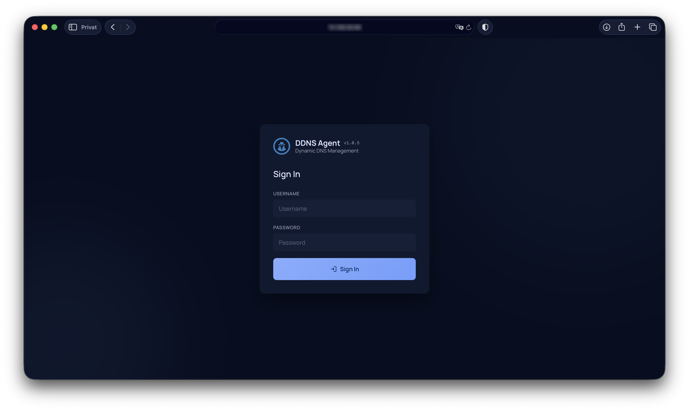
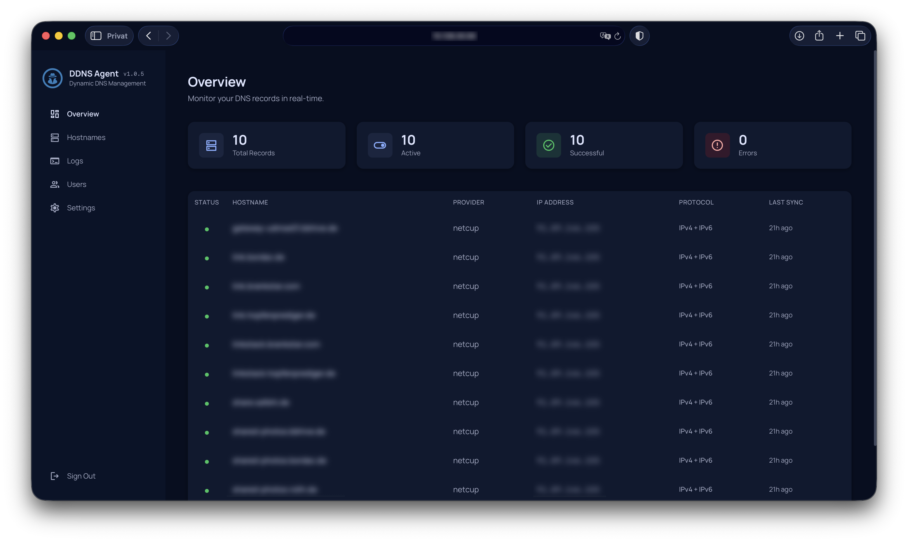
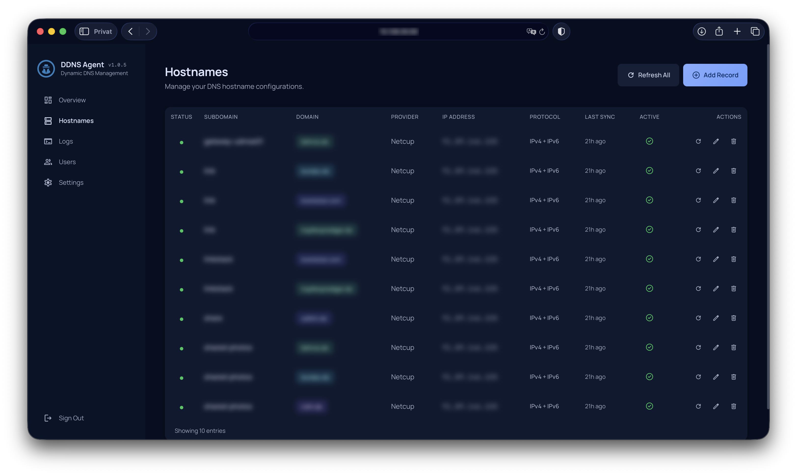
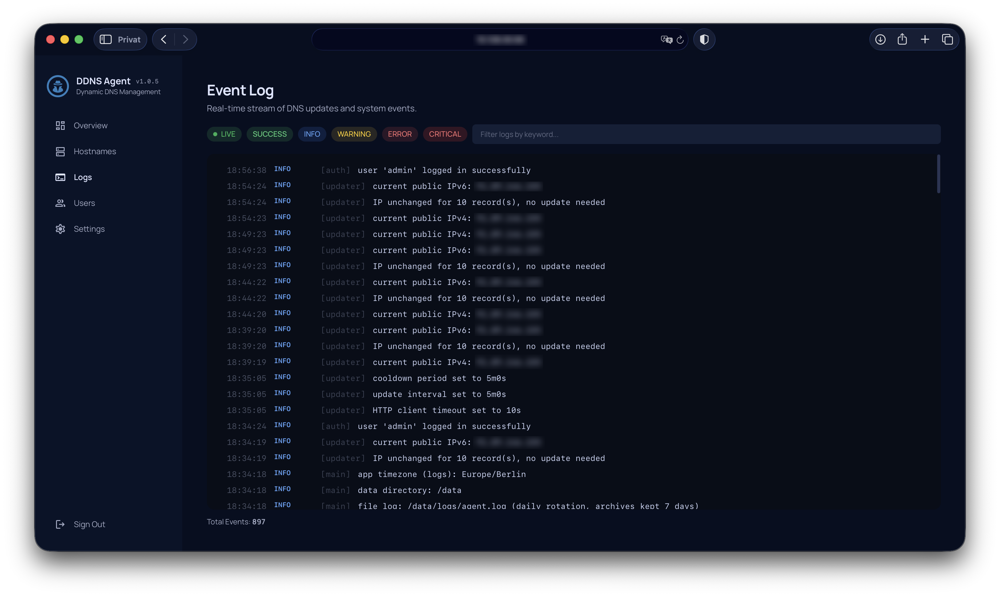
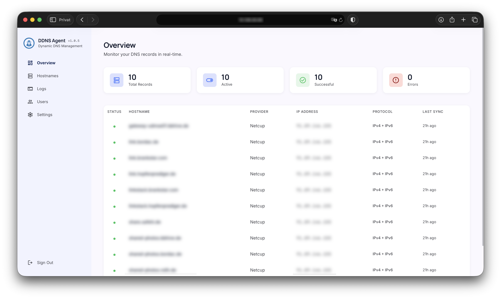
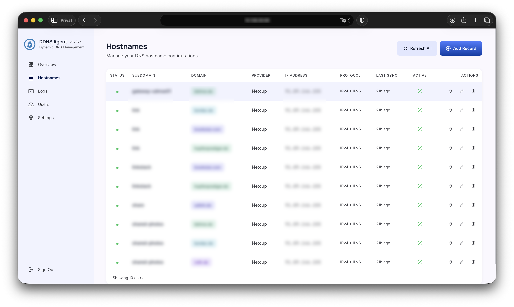
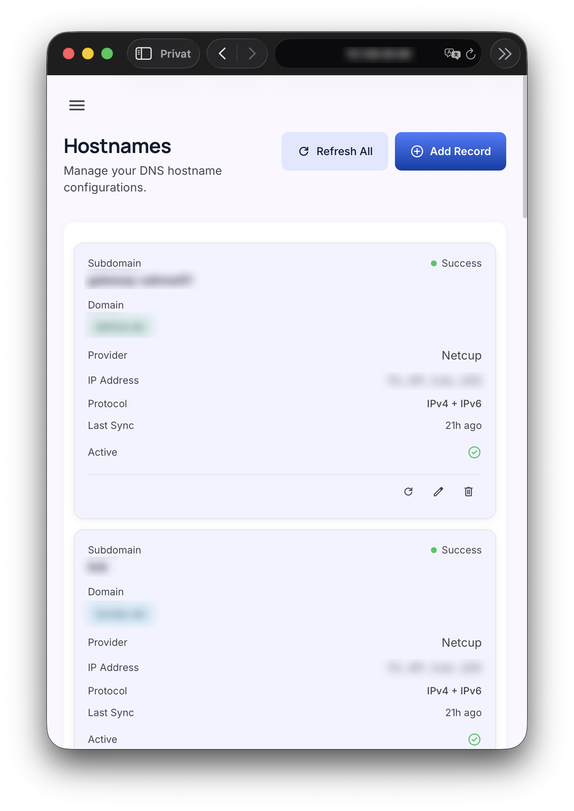
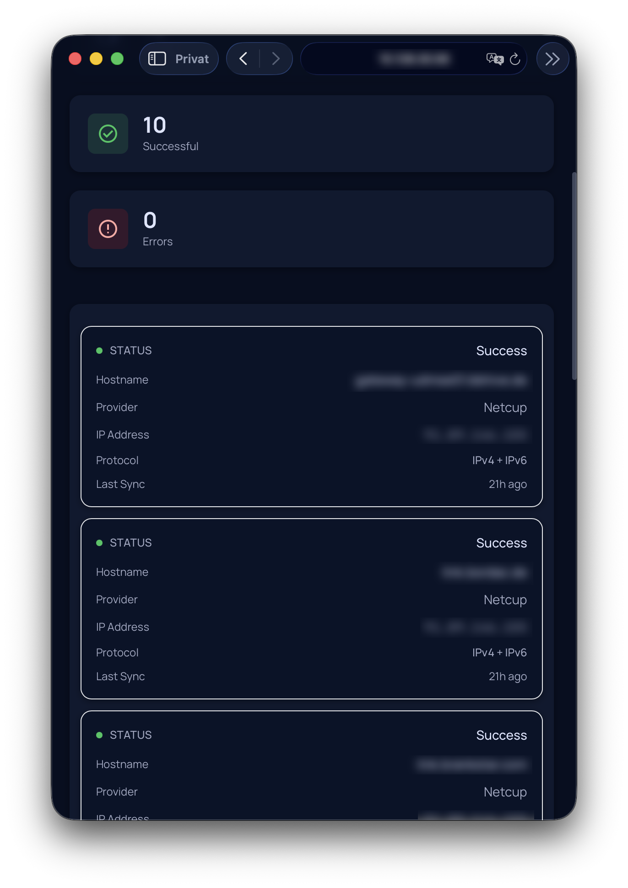

# DDNS Agent

Lightweight Dynamic DNS Updater with integrated Web Panel. Built with Go, Alpine.js, and Tailwind CSS.


 


## Origin

This project grew out of ideas and patterns from **[ddns-updater](https://github.com/qdm12/ddns-updater)** by [qdm12](https://github.com/qdm12). That tool is excellent for editing a JSON configuration file, but on phones and tablets I often needed to change settings on the go—and maintaining `config.json` manually was too cumbersome. I therefore built a full web interface on top of a similar update model so hostnames, users, and options can be managed in the browser. To keep the two projects clearly separate in purpose and naming, this one is published as **DDNS Agent** rather than as a fork of the same name.

## Development

Parts of this codebase were developed with assistance from **Claude Code** (Anthropic’s AI coding assistant).

## Features

- **52 DNS Providers** — Cloudflare, DuckDNS, GoDaddy, Hetzner, Namecheap, Porkbun, Route53, and 45 more
- **Web Panel** — Modern UI with dark/light theme, real-time log streaming, hostname management
- **IPv4 + IPv6** — Dual-stack support with automatic IP detection
- **Encrypted Credentials** — AES-256-GCM encryption at rest for all provider secrets
- **Webhook Notifications** — Discord, Telegram, Gotify, generic webhook
- **Auto Backup** — Daily database backups with configurable retention
- **Config Export/Import** — Full configuration portability
- **Multi-language** — English and German included, extensible via JSON language files
- **Role-based Access** — Admin and Viewer roles
- **Tiny Docker Image** — Scratch-based container, single static binary
- **File log** — Persistent `agent.log` under `/data/logs` with daily rotation to `agent-YYYY-MM-DD.log`; archive retention is configurable under **Settings → Advanced**

## Screenshots

<p align="center">
  
</p>

<p align="center">
  
</p>

<p align="center">
  
</p>

<p align="center">
  
</p>

<p align="center">
  
</p>

<p align="center">
  
</p>

<p align="center">
  
</p>

<p align="center">
  
</p>

## Quick Start

```bash
docker compose up -d
```

Open `http://localhost:8080` and sign in with default credentials: `admin` / `admin`.

**Important:** Change the default password after first login.

## Docker Compose

```yaml
services:
  ddns-agent:
    build: .
    container_name: ddns-agent
    restart: unless-stopped
    ports:
      - "8080:8080"
    volumes:
      - ddns-data:/data
volumes:
  ddns-data:
```

## Environment Variables

| Variable | Default | Description |
|---|---|---|
| `DDNS_DATA_DIR` | `/data` | Persistent data directory (database, backups, `/logs`, encryption key) |
| `DDNS_PORT` | `8080` | Web panel port |
| `DDNS_UPDATE_INTERVAL` | `5m` | Fallback at startup if `refresh_interval` is missing or invalid in the database (normally configured under **Settings**) |
| `DDNS_COOLDOWN` | `5m` | Fallback at startup if `cooldown_seconds` is missing or invalid in the database (**Settings → Advanced**) |
| `DDNS_HTTP_TIMEOUT` | `10s` | Fallback at startup if `http_timeout_seconds` is missing or invalid in the database (**Settings → Advanced**) |
| `DDNS_BACKUP_RETENTION` | `7` | Fallback at startup if `backup_retention` is missing or invalid in the database (**Settings → Advanced**) |
| `DDNS_LOG_RETENTION` | `7` | Fallback at startup if `log_archive_days` is missing or invalid in the database (**Settings → Advanced**) |
| `DDNS_JWT_SECRET` | auto | JWT signing key (auto-generated if empty) |
| `DDNS_ENCRYPTION_KEY` | auto | AES-256 key as 64 hex chars (auto-generated to `/data/.key`) |

## Building from Source

```bash
CGO_ENABLED=1 go build -ldflags="-s -w" -o ddns-agent ./cmd/ddns-agent
```

Or use Docker:

```bash
docker build -t ddns-agent .
```

## Adding Languages

Create a JSON file in `web/lang/` following the structure of `en.json`:

```
web/lang/fr.json
```

The language will automatically appear in the settings dropdown.

## Supported Providers

Alibaba Cloud (Aliyun), ALL-INKL, ChangeIP, Cloudflare, Custom URL, DD24, DDNSS.de, deSEC, DigitalOcean, DNS-O-Matic, DNSPod, Domeneshop, DonDominio, Dreamhost, DuckDNS, Dyn, Dynu, dynv6, EasyDNS, FreeDNS, Gandi, Google Cloud DNS, GoDaddy, GoIP.de, Hurricane Electric, Hetzner, Infomaniak, INWX, IONOS, Linode, Loopia, LuaDNS, myaddr.tools, Namecheap, Name.com, NameSilo, Netcup, Njalla, No-IP, Now-DNS, OpenDNS, OVH, Porkbun, AWS Route 53, Selfhost.de, Servercow, spdyn.de, Strato, Variomedia, Vultr, ZoneEdit

## Architecture

```
cmd/ddns-agent/       Entry point, graceful shutdown
internal/
  auth/               JWT, bcrypt, rate limiting, role-based access
  backup/             Auto-backup, config export/import
  config/             Environment-based configuration
  crypto/             AES-256-GCM encryption
  database/           SQLite with WAL mode
  ipcheck/            Public IP detection (round-robin, retry)
  logger/             Structured logging with SSE broadcast
  provider/           52 provider implementations
  server/             Chi router, API handlers, SSE broker
  updater/            DNS update scheduler
  webhook/            Notification dispatching
web/                  Frontend (Alpine.js + Tailwind CSS)
```

## License

This project is licensed under the [MIT License](LICENSE).
